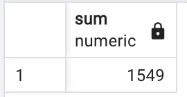

# Pewlett-Hackard-Analysis - Module 7

## Overview of the analysis:

### Purpose of Analysis

  1. To determine the number of retiring employees per title.
  2. Identify employees who are eligible to participate in a mentorship program.

## Results:

### The number of Retiring Employees by Title 

As shown in the image below, a significant number of 'Senior Engineers' and 'Senior Staff' are at retirement age. This shows the most vulnerable positions (Titles) for the expected 'Silver Tsunami'.

### Employees Eligible to Participate in a Mentorship Program

In order to prepare for the upcoming retirements of many employees, management is interested in starting a mentorship program. As the image below shows, there are a number of employees nearing the retirement age that would be great candidates for the program. Specifically, in the aforementioned roles of 'Senior Engineers' and 'Senior Staff'. 

### Results - Key Points

1. The titles 'Senior Engineers' and 'Senior Staff' have the most employees at retirement age at 25,916 and 24,926 respectively. 

2. The total number of Employees expected to retire is 72,458. 

3. The total number of eligible employees for the mentorship program is highest for the titles of 'Senior Engineer' and 'Staff'.

4. The total number of eligible employees for the mentorship program is significantly lower than the employees expected to retire. The total eligible employees is only 1,549. Management should expand the age eligibility for the mentorship program. 

## Summary:

I think the number of employees nearing retirement age should be a focus of upper management. Specifically, for the roles of 'Senior Engineers' and 'Senior Staff'. Management should consider hiring additional employees at slightly lower/equivalent roles to eventually fill those positions. For employees not immediatly expected to retire, proposing the mentorship program will provide a smoother transition in the work force as employees retire. 

1. How many roles will need to be filled as the "silver tsunami" begins to make an impact?
- The "Silver Tsunami" should expect 72,458 people to retire soon, those roles need to be filled. (Birthdates being between 1952-1956)
  - Using the following query, we can acquire the sum total from our retiring_titles table in SQL.

        SELECT SUM(count)
        FROM title_retire_table;

   

2. Are there enough qualified, retirement-ready employees in the departments to mentor the next generation of Pewlett Hackard employees? 
- No, there is a significant difference between 'Retiring Employees' (Birth Year 1952-1956) and 'Mentorship Eligible Employees' (Birth Year 1965). 'Retiring Employees' total 72,458 as shown above. The total 'Mentorship Eligible Employees' is only 1,549, that means there is a 70,909 expected employee deficit. Using the SQL query below, I created a new table to identify the titles of 'Mentorship Eligible Employees'. I then used another SQL query to sum the total counts of 'Mentorship Eligible Employees'. 
- The company should consider a significant hiring increase. The company should also expand the constraints for the mentorship program from only the Birth Year 1965, to a range such as Birth Year 1963-1968. 

      -- Create Table to show elibible employees count
      SELECT COUNT(me.title), me.title
      -- INTO mentor_elig_count
      FROM mentorship_elig as me
      GROUP BY me.title 
      ORDER BY me.count DESC;

      -- Create Table to show elibible employees sum
      SELECT SUM(count)
      FROM mentor_elig_count;

   
   

